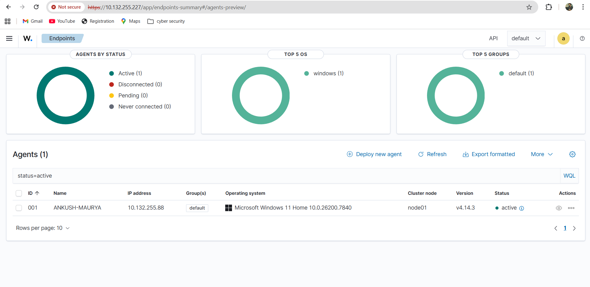
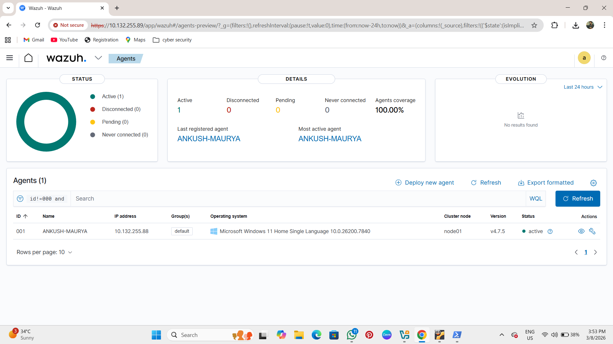
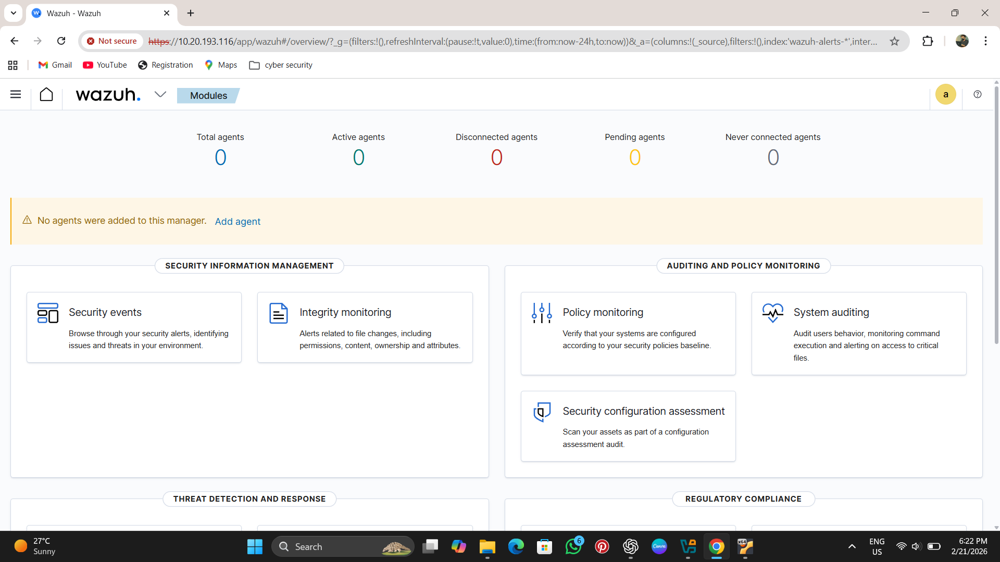
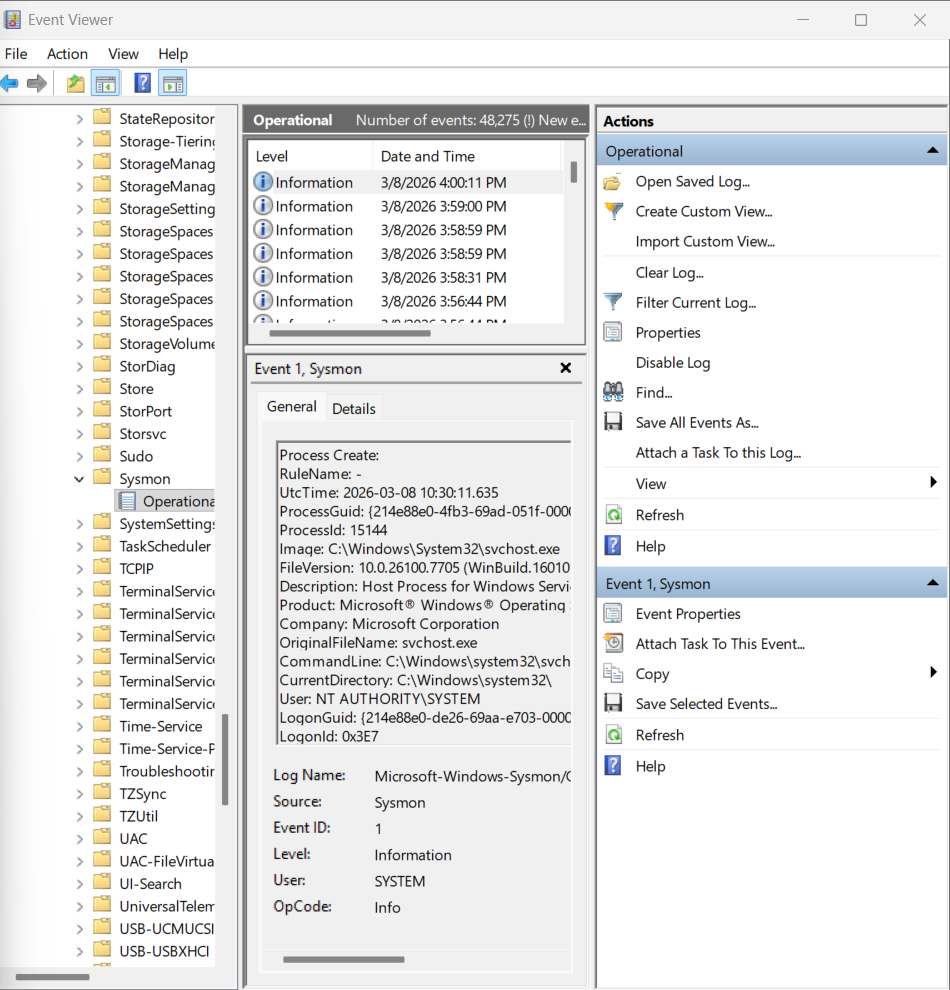

# Week 1 — Infrastructure Setup & Agent Deployment (Wazuh SIEM Lab)

## Objective

The objective of Week 1 was to build the foundation of the SOC-SIEM monitoring environment by installing the Wazuh Manager, deploying Wazuh Agents on endpoints, and enabling Sysmon for deep Windows telemetry visibility.

This setup created the centralized logging infrastructure required for detection, threat monitoring, and active response in later stages of the SOC lab.

---

# Lab Architecture Components Used

The following systems were configured during Week 1:

| Component | Role |
|----------|------|
| Wazuh Manager (Linux Server) | Central log collection & analysis |
| Windows Endpoint | Endpoint monitoring using Wazuh Agent |
| Sysmon | Advanced process-level logging |
| Wazuh Dashboard | Alert visualization interface |

---

# Step 1 — Install Wazuh Manager on Linux Server

Updated system packages:

```bash
sudo apt update && sudo apt upgrade -y
```

Installed Wazuh Manager:

```bash
curl -sO https://packages.wazuh.com/4.7/wazuh-install.sh
sudo bash wazuh-install.sh -a
```

Verified installation:

```bash
sudo systemctl status wazuh-manager
```

Result:

Wazuh Manager installed successfully and running.

---

# Step 2 — Access Wazuh Dashboard

Opened browser and accessed:

```
https://<WAZUH-SERVER-IP>
```

Logged into dashboard successfully.

Dashboard confirmed active SIEM interface availability.

---

# Step 3 — Install Wazuh Agent on Windows Endpoint

Downloaded Wazuh Agent from official website:

```
https://packages.wazuh.com
```

Installed agent on Windows machine.

Configured Manager IP inside agent settings.

Started agent service:

```
Services → Wazuh Agent → Start
```

Verified connection from dashboard.

---

# Step 4 — Verify Agent Connectivity Status

Checked agent status from Wazuh dashboard:

```
Wazuh Dashboard → Agents
```

Observed:

```
Agent Status = Active
```

This confirms endpoint successfully connected with Manager.

---

# Step 5 — Install Sysmon on Windows Endpoint

Downloaded Sysmon from Microsoft Sysinternals:

```
https://learn.microsoft.com/sysinternals/downloads/sysmon
```

Installed Sysmon:

```bash
sysmon64.exe -i sysmonconfig.xml
```

Verified installation:

```
Event Viewer → Applications and Services Logs → Microsoft → Windows → Sysmon
```

Sysmon started generating telemetry logs successfully.

---

# Step 6 — Validate Log Visibility Inside Dashboard

Opened:

```
Wazuh Dashboard → Security Events
```

Observed logs:

- Endpoint connection logs
- Authentication activity
- Process monitoring logs
- Sysmon telemetry events

This confirms centralized logging working correctly.

---

# Output Verification

Infrastructure setup validated successfully through:

- Wazuh Manager installed and running
- Windows agent connected successfully
- Agent heartbeat visible in dashboard
- Sysmon installed successfully
- Endpoint telemetry visible inside SIEM

This confirms SOC monitoring infrastructure operational.

---

# Screenshots

Screenshots stored inside:

```
week1-infrastructure/screenshots/
```

---

## Wazuh Agent Status (Connected)



Shows successful connection between endpoint and Wazuh Manager.

---

## Wazuh Agent Active Confirmation



Shows agent heartbeat active inside Wazuh dashboard.

---

## Wazuh Dashboard Monitoring Interface



Shows centralized alert monitoring dashboard interface.

---

## Sysmon Installation Verification



Shows Sysmon telemetry enabled inside Windows endpoint.

---

# Problems Faced During Implementation

## Problem 1 — Agent Not Connecting Initially

Cause:

Incorrect Manager IP configured in agent settings.

Solution:

Updated Manager IP correctly inside agent configuration and restarted agent service.

---

## Problem 2 — Dashboard Not Opening Initially

Cause:

Firewall blocking required ports.

Solution:

Allowed required ports:

```bash
sudo ufw allow 5601/tcp
sudo ufw allow 1514/tcp
sudo ufw allow 1515/tcp
```

Dashboard opened successfully.

---

## Problem 3 — Sysmon Logs Not Visible Initially

Cause:

Sysmon configuration file missing.

Solution:

Installed Sysmon again with configuration file:

```bash
sysmon64.exe -i sysmonconfig.xml
```

Telemetry logs started appearing successfully.

---

# Conclusion

In Week 1, the SOC-SIEM monitoring infrastructure was successfully deployed by installing the Wazuh Manager, connecting Windows endpoint agents, and enabling Sysmon telemetry collection.

This created the foundation for centralized monitoring, detection rule configuration, active response automation, and threat simulation activities implemented in later stages of the project.
