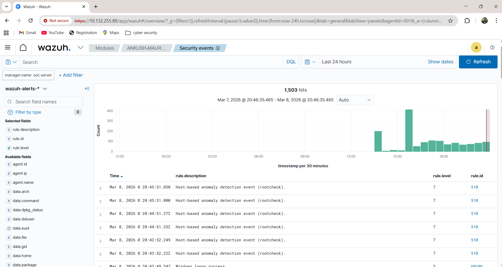
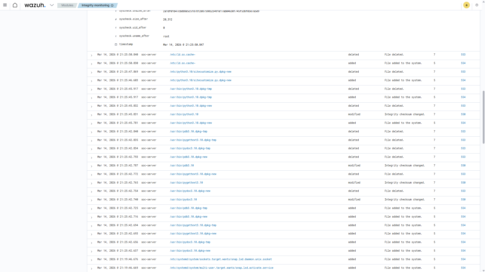

# Week 2 — Detection Rules Configuration (FIM, Rootcheck & Vulnerability Detection)

## Objective

The objective of Week 2 was to configure detection logic inside the Wazuh SIEM environment by enabling File Integrity Monitoring (FIM), Rootcheck monitoring, and the Vulnerability Detection module.

These configurations help detect unauthorized file modifications, suspicious system activity, and known vulnerabilities on monitored endpoints. This phase significantly improved the detection capability of the SOC monitoring environment.

---

# Detection Architecture Flow

Windows / Linux Endpoint  
↓  
File Changes / Registry Changes / System Activity  
↓  
Wazuh Agent Monitoring  
↓  
Wazuh Manager Correlation Engine  
↓  
Security Alerts Generated in Dashboard

---

# Tools Used

| Tool | Purpose |
|------|---------|
| Wazuh Manager | Detection engine |
| Wazuh Agent | Endpoint monitoring |
| Rootcheck | Suspicious activity detection |
| FIM Module | File integrity monitoring |
| Vulnerability Detector | CVE detection |

---

# Step 1 — Enable File Integrity Monitoring (FIM)

FIM monitors sensitive system files and directories for:

- File modification
- File deletion
- File creation
- Permission changes

Open configuration file:

```bash
/var/ossec/etc/ossec.conf
```

Add monitored directory:

```xml
<syscheck>
  <directories realtime="yes">/etc</directories>
</syscheck>
```

Restart agent service:

```bash
sudo systemctl restart wazuh-agent
```

This enables real-time monitoring of critical system files.

---

# Step 2 — Trigger FIM Alert Manually

Create test directory:

```bash
sudo mkdir /tmp/ransomware_test
```

Create test files:

```bash
sudo touch /tmp/ransomware_test/file1
sudo touch /tmp/ransomware_test/file2
```

Delete directory:

```bash
sudo rm -rf /tmp/ransomware_test
```

These actions generate real-time alerts inside the Wazuh dashboard.

---

# Step 3 — Verify FIM Alerts Inside Dashboard

Navigate:

```
Wazuh Dashboard → Security Events
```

Observed alerts:

- File added to system
- Integrity checksum changed
- File deleted

This confirms File Integrity Monitoring is working correctly.

---

# Step 4 — Enable Rootcheck Monitoring

Rootcheck detects:

- Rootkits
- Hidden processes
- Suspicious binaries
- System anomalies

Open configuration file:

```bash
/var/ossec/etc/ossec.conf
```

Ensure rootcheck enabled:

```xml
<rootcheck>
  <disabled>no</disabled>
</rootcheck>
```

Restart agent:

```bash
sudo systemctl restart wazuh-agent
```

Rootcheck monitoring activated successfully.

---

# Step 5 — Verify Rootcheck Alerts

Navigate:

```
Security Events → Filter → rootcheck
```

Observed alerts:

```
Host-based anomaly detection event (rootcheck)
```

This confirms rootcheck detection is operational.

---

# Step 6 — Enable Vulnerability Detection Module

Open configuration file:

```bash
/var/ossec/etc/ossec.conf
```

Add:

```xml
<vulnerability-detector>
  <enabled>yes</enabled>
  <interval>5m</interval>
</vulnerability-detector>
```

Restart manager service:

```bash
sudo systemctl restart wazuh-manager
```

This enables CVE scanning capability.

---

# Step 7 — Verify Vulnerability Detection

Navigate:

```
Dashboard → Vulnerabilities
```

Detected:

- Outdated packages
- Known CVEs
- Security exposure indicators

This confirms vulnerability monitoring is active.

---

# Output Verification

Detection system confirmed operational by:

- File change alerts generated successfully
- Rootcheck anomaly alerts detected
- Integrity checksum alerts visible
- Vulnerability detector enabled successfully
- Events visible inside Security Dashboard

---

# Screenshots

Screenshots stored inside:

```
week2-detection-rules/screenshots/
```

---

## Rootcheck Alert Detection



Shows host-based anomaly detection events triggered by rootcheck module.

---

## File Integrity Monitoring Alerts



Shows file addition, deletion, and checksum modification alerts detected by Wazuh.

---

## Alerts JSON Log Verification


Shows raw alerts.json log entries confirming backend detection processing.

---

# Problems Faced During Implementation

## Problem 1 — FIM Alerts Not Appearing Initially

Cause:

Realtime monitoring not enabled inside configuration.

Solution:

Updated configuration:

```xml
<directories realtime="yes">/etc</directories>
```

Restarted agent:

```bash
sudo systemctl restart wazuh-agent
```

Alerts appeared successfully afterward.

---

## Problem 2 — Rootcheck Alerts Delayed

Cause:

Rootcheck scheduled scan interval delay.

Solution:

Executed manual scan:

```bash
sudo /var/ossec/bin/rootcheck_control -u
```

Alerts generated immediately.

---

## Problem 3 — Vulnerability Detector Not Starting

Cause:

Manager restart required after enabling module.

Solution:

Restarted manager service:

```bash
sudo systemctl restart wazuh-manager
```

Module activated successfully.

---

# Conclusion

In Week 2, detection capabilities of the SOC environment were significantly improved by enabling File Integrity Monitoring, Rootcheck anomaly detection, and Vulnerability Detection modules.

These configurations allowed real-time monitoring of critical system files, detection of suspicious behavior, and identification of known security vulnerabilities across monitored endpoints.
