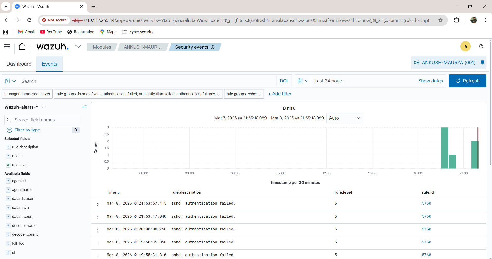
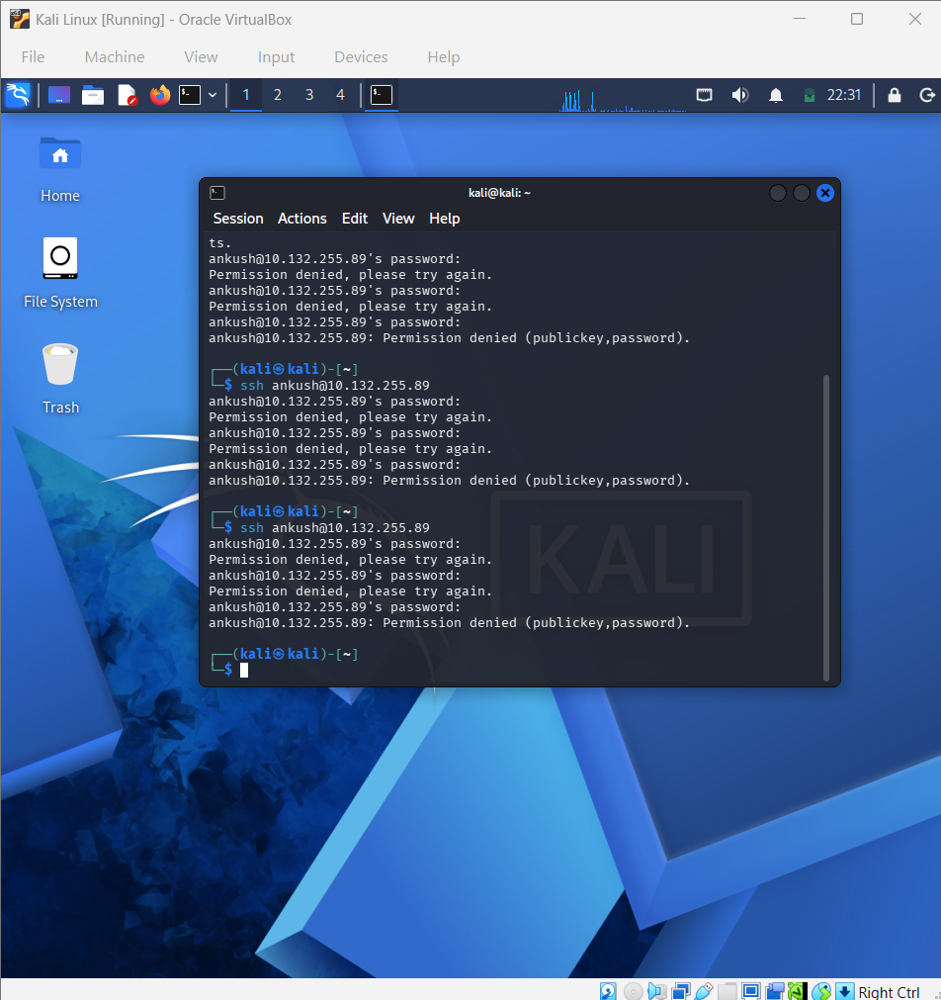
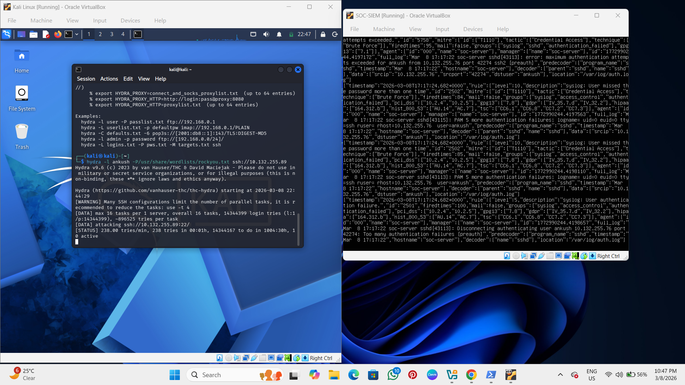
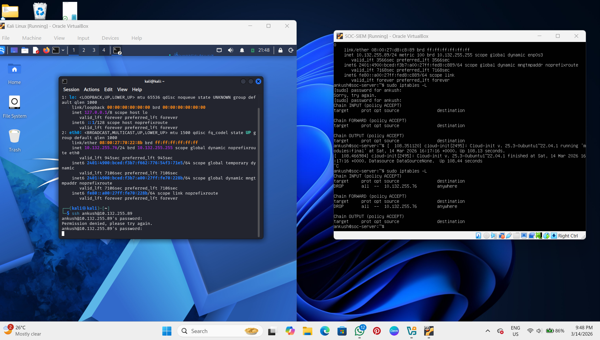

# Week 3 — Active Response Configuration (SSH Brute-Force Detection & Automatic Firewall Blocking)

## Objective

The objective of Week 3 was to implement Active Response capabilities in the Wazuh SIEM environment to automatically detect and block SSH brute-force attacks.

A simulated attack was performed from a Kali Linux attacker machine using Hydra. Wazuh successfully detected multiple failed login attempts and automatically blocked the attacker IP address using firewall rules.

This demonstrated real-time intrusion prevention capability inside the SOC monitoring infrastructure.

---

# Active Response Architecture Flow

Kali Linux (Attacker Machine)

↓

Hydra SSH Brute-Force Attack

↓

Multiple Authentication Failures

↓

Wazuh Detection Rule Triggered

↓

Active Response Script Executed

↓

Firewall Automatically Blocks Attacker IP

---

# Tools Used

| Tool | Purpose |
|------|---------|
| Wazuh Manager | Detection & response engine |
| Wazuh Agent | Endpoint monitoring |
| Kali Linux | Attack simulation |
| Hydra | SSH brute-force attack tool |
| iptables Firewall | Automatic attacker blocking |

---

# Step 1 — Enable Active Response in Wazuh

Open configuration file:

```bash
/var/ossec/etc/ossec.conf
```

Add configuration:

```xml
<active-response>
  <command>firewall-drop</command>
  <location>local</location>
  <level>6</level>
</active-response>
```

Restart Wazuh Manager:

```bash
sudo systemctl restart wazuh-manager
```

Active response module enabled successfully.

---

# Step 2 — Verify SSH Service Running on Target Machine

Check SSH service status:

```bash
sudo systemctl status ssh
```

Start SSH service if required:

```bash
sudo systemctl start ssh
```

Confirm SSH running on port 22.

---

# Step 3 — Simulate SSH Brute-Force Attack Using Hydra

Run attack from Kali Linux:

```bash
hydra -l ankush -P /usr/share/wordlists/rockyou.txt ssh://10.132.255.89
```

This generates multiple authentication failures which trigger Wazuh alerts.

---

# Step 4 — Detect Authentication Failures in Wazuh Dashboard

Navigate to:

```
Wazuh Dashboard → Security Events
```

Observed alerts:

```
sshd: authentication failed
multiple login failures detected
```

This confirms brute-force detection working correctly.

---

# Step 5 — Automatic Firewall Blocking Triggered

After repeated failed login attempts:

Wazuh executed:

```
firewall-drop
```

Attacker IP automatically blocked.

Verify firewall rule:

```bash
sudo iptables -L
```

Observed:

```
DROP 10.132.255.76
```

This confirms automated intrusion prevention working successfully.

---

# Step 6 — Verify Alerts in alerts.json Log File

Check alerts log:

```bash
/var/ossec/logs/alerts/alerts.json
```

Observed events:

```
authentication failures detected
firewall drop executed
attacker IP blocked automatically
```

Confirms Active Response execution completed successfully.

---

# Output Verification

Active Response configuration verified successfully through:

- SSH brute-force attack simulation executed
- Authentication failure alerts detected
- Hydra attack traffic identified
- Automatic firewall blocking triggered
- Attacker IP dropped using iptables
- Alerts visible inside Wazuh dashboard

This confirms IPS automation working correctly.

---

# Screenshots

Screenshots stored inside:

```
week3-active-response/screenshots/
```

---

## SSH Authentication Failure Detection



Shows multiple failed SSH login attempts detected by Wazuh SIEM.

---

## Kali Linux SSH Brute-Force Attempt



Shows repeated SSH login attempts performed from Kali Linux attacker machine.

---

## Hydra Brute-Force Attack Execution



Shows Hydra performing brute-force attack against target system.

---

## Automatic Firewall Blocking Verification



Shows attacker IP automatically blocked using firewall rule after detection.

---

# Problems Faced During Implementation

## Problem 1 — SSH Service Not Running Initially

Cause:

SSH service was not active on SOC server.

Solution:

Started SSH service manually:

```bash
sudo systemctl start ssh
```

---

## Problem 2 — Active Response Not Triggering Initially

Cause:

Active response configuration missing inside ossec.conf file.

Solution:

Added configuration block:

```xml
<active-response>
  <command>firewall-drop</command>
  <location>local</location>
  <level>6</level>
</active-response>
```

Restarted manager:

```bash
sudo systemctl restart wazuh-manager
```

---

## Problem 3 — Attacker IP Not Appearing in Firewall Rules Immediately

Cause:

Firewall rules refreshed after short delay.

Solution:

Verified manually:

```bash
sudo iptables -L
```

Drop rule confirmed successfully.

---

# Conclusion

In Week 3, Active Response functionality was successfully implemented in the Wazuh SIEM environment to detect and block SSH brute-force attacks automatically.

A simulated Hydra attack from Kali Linux generated authentication failures that triggered Wazuh detection rules and executed automated firewall blocking against the attacker IP address.

This demonstrated real-time intrusion prevention capability inside the SOC infrastructure.
