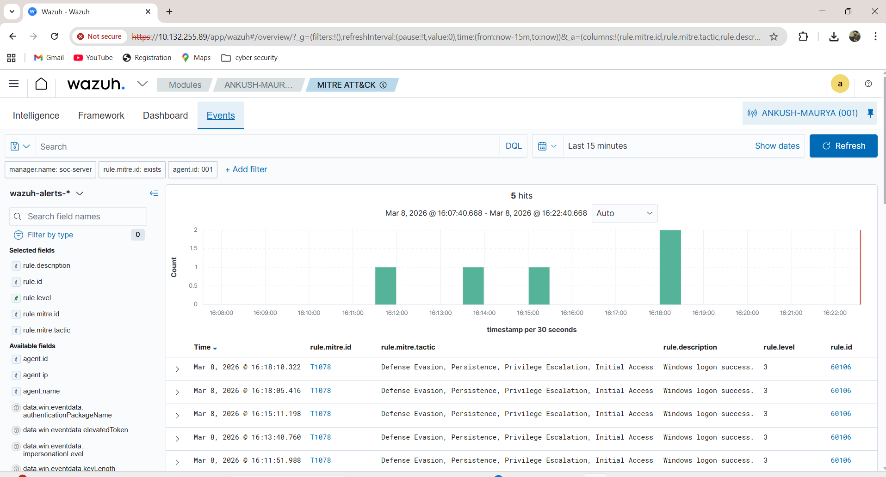
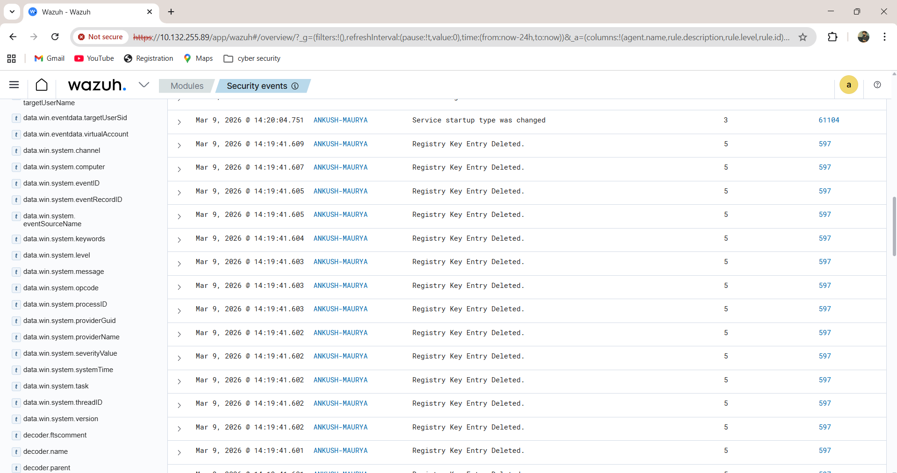
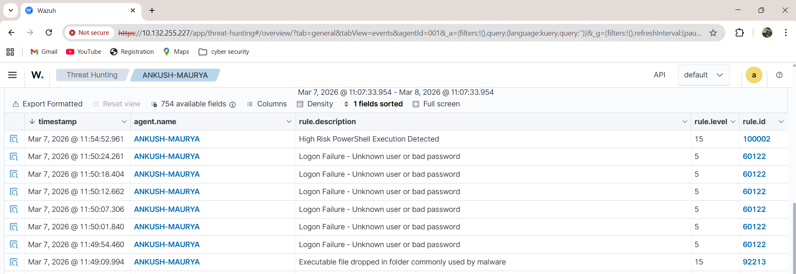
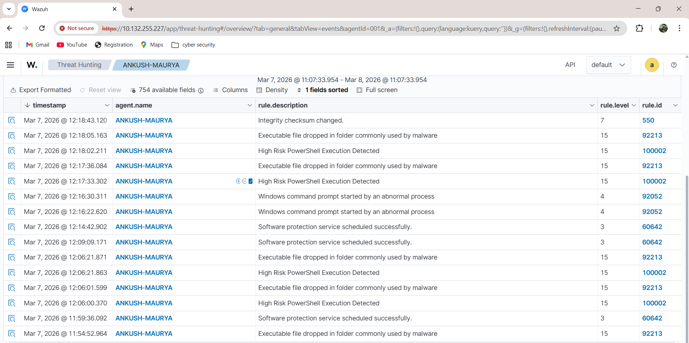

# Week 4 — Threat Simulation & MITRE ATT&CK Mapping (Atomic Red Team Simulation)

## Objective

The objective of Week 4 was to simulate real-world attacker techniques using the Atomic Red Team framework and verify detection visibility inside the Wazuh SIEM dashboard.

This week focused on ransomware-style activity simulation, registry modification detection, logon failure monitoring, malware-like behavior alerts, and MITRE ATT&CK mapping validation.

The goal was to demonstrate the complete SOC detection lifecycle from attack simulation to threat hunting visualization.

---

# Threat Simulation Workflow

Atomic Red Team Simulation

↓

System Activity Changes

↓

Wazuh Agent Monitoring

↓

Alert Generation

↓

MITRE ATT&CK Mapping

↓

Threat Hunting Dashboard Visibility

---

# Tools Used

| Tool | Purpose |
|------|---------|
| Wazuh SIEM | Threat detection and monitoring |
| Atomic Red Team | Attack simulation framework |
| MITRE ATT&CK | Technique mapping |
| Windows Endpoint | Target machine |
| Wazuh Dashboard | Threat hunting visualization |

---

# Step 1 — Atomic Red Team Simulation (Registry Key Deletion Activity)

Simulated registry modification behavior similar to ransomware activity.

Example registry command simulation:

```
reg delete HKCU\Software\TestKey /f
```

This triggered registry change detection alert inside Wazuh.

Observed alert:

```
Registry Key Entry Deleted
```

This confirms endpoint monitoring working successfully.

---

# Step 2 — Detect Logon Failure Events (Credential Attack Simulation)

Simulated multiple failed login attempts to generate authentication alerts.

Observed detection:

```
Logon Failure — Unknown user or bad password
```

Mapped to MITRE ATT&CK technique:

```
T1078 — Valid Accounts
```

These alerts confirm credential abuse monitoring enabled successfully.

---

# Step 3 — Detect Malware-like Execution Behavior

Simulated suspicious executable activity commonly used by malware.

Observed alerts:

```
Executable file dropped in folder commonly used by malware
High Risk PowerShell Execution Detected
```

This confirms malware behavior detection working correctly.

---

# Step 4 — MITRE ATT&CK Technique Mapping Validation

Navigated to:

```
Wazuh Dashboard → MITRE ATT&CK Module
```

Observed mapped detection:

```
T1078 — Valid Accounts
```

This confirms Wazuh successfully correlates alerts with attacker techniques.

MITRE mapping improves SOC analyst investigation capability.

---

# Step 5 — Threat Hunting Dashboard Visualization

Opened:

```
Threat Hunting → Security Events
```

Observed alerts:

```
Registry Key Entry Deleted
Logon Failure Events
Malware Execution Alerts
PowerShell Suspicious Activity
```

This confirms threat visibility across multiple attack stages.

---

# Output Verification

Threat simulation successfully validated through:

- Registry deletion alerts detected
- Credential failure events captured
- Malware execution behavior identified
- PowerShell suspicious activity detected
- MITRE ATT&CK mapping confirmed
- Threat hunting dashboard alerts visible

This confirms end-to-end SOC detection workflow operational.

---

# Screenshots

Screenshots stored inside:

```
week4-threat-simulation/screenshots/
```

---

## MITRE ATT&CK Technique Mapping (T1078)



Shows detection mapped to MITRE ATT&CK technique T1078 (Valid Accounts).

---

## Registry Key Deletion Detection Alert



Shows registry modification activity detected by Wazuh SIEM.

---

## Threat Hunting Logon Failure Detection



Shows failed authentication attempts visible inside Threat Hunting dashboard.

---

## Threat Hunting Malware Detection Alerts



Shows suspicious executable and PowerShell activity detected.

---

# Problems Faced During Implementation

## Problem 1 — MITRE Mapping Not Visible Initially

Cause:

MITRE ATT&CK module filters not refreshed.

Solution:

Reloaded dashboard:

```
Refresh → Security Events → MITRE ATT&CK Module
```

Mapping appeared successfully.

---

## Problem 2 — Registry Deletion Alert Delay

Cause:

Agent sync interval delay.

Solution:

Restarted Wazuh agent service:

```
sudo systemctl restart wazuh-agent
```

Alert generated successfully.

---

## Problem 3 — PowerShell Detection Not Triggering Initially

Cause:

Sysmon configuration missing required event rules.

Solution:

Updated Sysmon configuration and restarted service.

```
sysmon64.exe -c sysmonconfig.xml
```

Detection started working properly.

---

# Conclusion

In Week 4, Atomic Red Team techniques were simulated to reproduce ransomware-style registry modification behavior, credential access attempts, and suspicious PowerShell execution activity.

Wazuh successfully detected these simulated attacks and mapped them to MITRE ATT&CK techniques such as T1078 (Valid Accounts). Alerts were visualized inside the Threat Hunting dashboard, confirming end-to-end detection capability.

This completed the full SOC workflow implementation including monitoring, detection, response automation, threat simulation, and adversary technique mapping using Wazuh SIEM.
